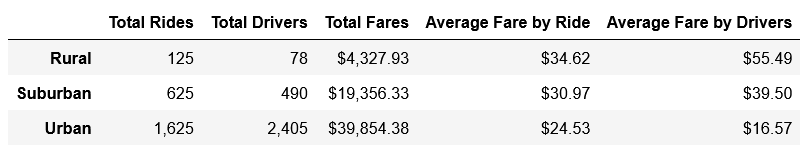
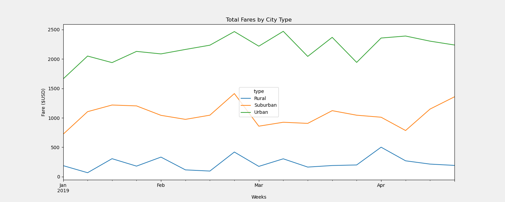

# PyBer Analysis

## Overview

We were asked to analysis PyBer data using Pandas, Numpy, and Matplotlib. We were asked to create a dataframe that contains a summary of the data based on the city type and a graph which shows the weekly fares by each city type. With the results, we will analyze how the data is different based on the city type and how we can make decisions based on our findings.

## Results

### Summary of results

When we created the summary dataframe based on city type we got the following results as shown in the charts below.

- Rural
   - Lowest Number of Rides and Drivers
   - Lowest Total of Fares
   - Highest Average Fare by Ride and Driver
- Suburban
   - Middle Number of Rides and Drivers
   - Middle Total of Fares
   - Middle Average Fare by Ride and Driver
- Urban
   - Highest Number of Rides and Drivers
   - Highest Total of Fares
   - Lowest Average Fare by Ride and Driver

We were then asked to take the ride data, convert it into a datetime stamp, and created a line graph based on the weekly total fares based on the city type. (See graph below)

There is a description of the differences in ride-sharing data among the different city types. Ride-sharing data include the total rides, total drivers, total fares, average fare per ride and driver, and total fare by city type. (7 pt)

### Charts and Graphs

#### Pyber Data Summary

#### Pyber Fare Summary

   
## Summary:

### Conclusions from Data

After we performed the analysis, we can see that over 60% of the total fares come from the urban city centers. Based on the data, here are some recommendations for addressing the disparities between the city types. 

- Rural drivers have the highest cost per drivers. We can add an incentives to get more drivers in the rural city types.
- Suburban fares make up over 30% of the total fares. We can add incentives to get more drivers in the suburban city types.
- Urban drivers make up over 60% of the total fares. We can raise how much each driver gets to more fall in line with the data.
